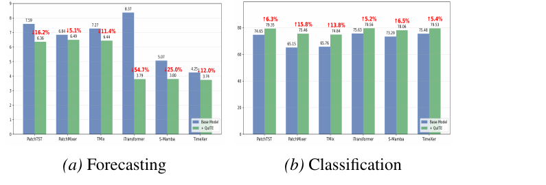
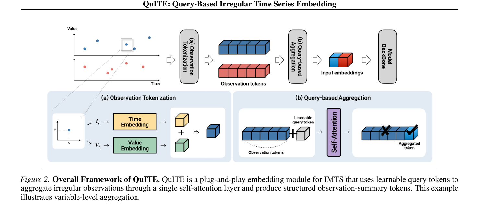
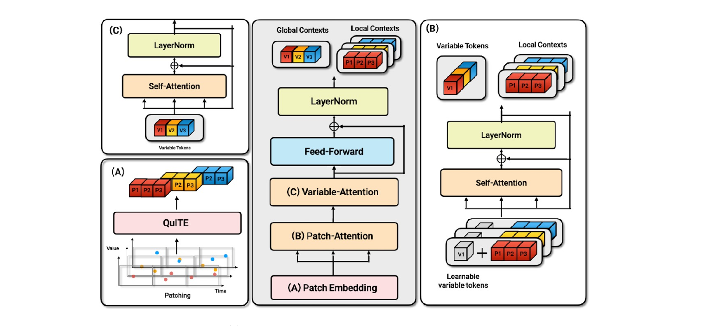

# [ICML 2026] QuITE: Query-Based Irregular Time Series Embedding

## 🔥News
[2026-05-01] **QuITE: Query-Based Irregular Time Series Embedding** is accepted by **ICML 2026**!

## Overview

This repository contains the official PyTorch implementation of *QuITE: Query-Based Irregular Time Series Embedding*. We propose **QuITE**, a plug-and-play **input-embedding** module for Irregular Multivariate Time Series (IMTS). QuITE employs learnable query tokens to aggregate irregular observations through a single masked self-attention layer, producing backbone-compatible latent representations — so any standard Multivariate Time Series (MTS) backbone (PatchTST, PatchMixer, TMix, iTransformer, S-Mamba, TimeXer) can be applied to IMTS **without architectural modification or artificial value generation**.

We also introduce **QuITE++**, a hierarchical extension that stacks query-based patch embedding → patch-level self-attention → variable-level self-attention, followed by a cross-attention decoder over future-time queries. QuITE / QuITE++ are evaluated on **7 datasets** across forecasting and classification, yielding **average relative gains of up to 54.7 % in forecasting and 15.8 % in classification** over the vanilla backbones (paper Tables 2-3).

### Contributions

- A new **input-embedding-based** approach for IMTS modeling, rather than designing specialized architectures or interpolating IMTS onto regular temporal grids.
- **QuITE** — a simple yet effective plug-and-play embedding module that introduces a set of learnable query tokens aggregating irregular observations via masked self-attention (paper §4).
- **QuITE++** — a hierarchical encoder + cross-attention decoder built from the same query-based principle, achieving the strongest forecasting performance on 20 / 24 settings (paper §5, Table 4).
- Consistent gains on 4 forecasting (Human Activity / USHCN / PhysioNet / MIMIC-III) and 3 classification (P12 / P19 / PAM) benchmarks across 6 MTS backbones.

<p align="center">
  
  <br/>
  <em>Figure 1. Effectiveness of QuITE. QuITE consistently improves performance across diverse datasets and backbone architectures. Values are averaged over all datasets.</em>
</p>

## The model framework of QuITE

<p align="center">
  
  <br/>
  <em>Figure 2. Overall Framework of QuITE. A plug-and-play embedding module for IMTS: learnable query tokens aggregate irregular observations through a single self-attention layer and produce structured observation-summary tokens.</em>
</p>

<p align="center">
  
  <br/>
  <em>Figure 3. Overall Architecture of QuITE++. A hierarchical encoder that models intra-variable patch-level temporal dependencies and inter-variable interactions via learnable query tokens.</em>
</p>

## Datasets

### Forecasting

We follow the benchmark on https://github.com/usail-hkust/t-PatchGNN and use four datasets: **PhysioNet**, **MIMIC-III**, **Human Activity**, and **USHCN**, covering the fields of healthcare, biomechanics, and climate science.

For *PhysioNet* and *Human Activity*, our code will automatically download the raw data and preprocess them.

For *USHCN*, following the [GRU-ODE-Bayes](https://github.com/edebrouwer/gru_ode_bayes/tree/master), we use the same preprocessed data `small_chunked_sporadic.csv` as the raw data.

For *MIMIC*, because of the [PhysioNet Credentialed Health Data License](https://physionet.org/content/mimiciii/view-dua/1.4/), you need to first request the raw database from [here](https://physionet.org/content/mimiciii/1.4/). The database version we used here is v1.4. After downloading the raw data, following the preprocessing of [Neural Flows](https://github.com/mbilos/neural-flows-experiments/blob/master/nfe/experiments/gru_ode_bayes/data_preproc/mimic_prep.ipynb), you will finally get the `full_dataset.csv` which is used as the raw data in our experiment.

### Classification

We conduct experiments on three widely used irregular time series datasets, namely **P19**, **P12**, and **PAM**, covering healthcare (sepsis early prediction, in-ICU mortality) and human activity recognition.

#### Raw data

**(1)** The PhysioNet Sepsis Early Prediction Challenge 2019 (**P19**) dataset consists of medical records from 38,803 patients. Each patient's record includes 34 variables. For every patient, there is a static vector indicating attributes such as age, gender, the time interval between hospital admission and ICU admission, type of ICU, and length of stay in the ICU measured in days. Additionally, each patient is assigned a binary label indicating whether sepsis occurs within the subsequent 6 hours. We follow the procedures of [Zhang et al., 2022](https://arxiv.org/abs/2110.05357) to ensure certain samples with excessively short or long time series are excluded. The raw data is available at https://physionet.org/content/challenge-2019/1.0.0/

**(2)** The **P12** dataset comprises data from 11,988 patients after 12 inappropriate samples identified by [Horn et al., 2020](https://arxiv.org/abs/1909.12064) were removed from the dataset. Each patient's record in the P12 dataset includes multivariate time series data collected during their initial 48-hour stay in the ICU. The time series data consists of measurements from 36 sensors (excluding weight). Additionally, each sample is associated with a static vector containing 9 elements, including age, gender, and other relevant attributes. Each patient is assigned a binary label indicating whether the length of their ICU stay exceeds three days. The raw data of **P12** can be found at https://physionet.org/content/challenge-2012/1.0.0/.

**(3)** The Physical Activity Monitoring (**PAM**) dataset is derived from PAMAP2 and contains 5,333 samples with 17 sensor channels recorded over 600 timestamps. After removing one subject and infrequent activities, the dataset spans **8 activity classes**. To simulate irregular sampling, 60% of observations are randomly removed. PAM samples carry no static features. The raw data is available at https://archive.ics.uci.edu/dataset/231/pamap2+physical+activity+monitoring

#### Processed data

For datasets **P19** and **P12**, we use the data processed by [Raindrop](https://github.com/mims-harvard/Raindrop).

The raw data can be found at:

**(1)** P19: https://physionet.org/content/challenge-2019/1.0.0/

**(2)** P12: https://physionet.org/content/challenge-2012/1.0.0/

The datasets processed by [Raindrop](https://github.com/mims-harvard/Raindrop) can be obtained at:

**(1)** P19 (PhysioNet Sepsis Early Prediction Challenge 2019) https://doi.org/10.6084/m9.figshare.19514338.v1

**(2)** P12 (PhysioNet Mortality Prediction Challenge 2012) https://doi.org/10.6084/m9.figshare.19514341.v1

For the **PAM** dataset, we follow the preprocessing protocol of [Raindrop](https://github.com/mims-harvard/Raindrop). The processed `.npy` arrays and 5 train/val/test splits are expected under `../data/PAM/processed_data/` and `../data/PAM/splits/`, respectively.

## Requirements

QuITE has been tested using Python 3.10+ and PyTorch 2.0+. To have consistent libraries and their versions, install the dependencies by running:

```
pip install -r requirements.txt
```

For the S-Mamba backbone, additionally install [`mamba-ssm`](https://github.com/state-spaces/mamba).

## Running the code

After obtaining the datasets and placing them under `../data/`, starting from the project root you can run models as follows.

### Forecasting

- **Human Activity**

The single run command for the default horizon is:

```
python train_forecasting.py --dataset activity --state def --history 3000 --patience 50 --batch_size 32 --lr 1e-3 --patch_size 750 --stride 750 --nhead 4 --nlayer 3 --hid_dim 64 --seed 1 --gpu 0 --irr_emb --model itransformer --mode quite
```

To evaluate performance across all horizons (6 backbones × 12 (dataset, horizon) settings × 5 seeds), execute:

```
bash jobs/run_forecasting.sh
```

- **USHCN**

The single run command for the default horizon is:

```
python train_forecasting.py --dataset ushcn --state def --history 24 --pred_window 1 --patience 50 --batch_size 128 --lr 1e-3 --patch_size 1.5 --stride 1.5 --nhead 4 --nlayer 3 --hid_dim 64 --seed 1 --gpu 0 --irr_emb --model itransformer --mode quite
```

- **PhysioNet**

The single run command for the default horizon is:

```
python train_forecasting.py --dataset physionet --state def --history 24 --patience 50 --batch_size 64 --lr 1e-3 --patch_size 6 --stride 6 --nhead 4 --nlayer 3 --hid_dim 64 --seed 1 --gpu 0 --irr_emb --model itransformer --mode quite
```

- **MIMIC-III**

The single run command for the default horizon is:

```
python train_forecasting.py --dataset mimic --state def --history 24 --patience 50 --batch_size 8 --lr 1e-3 --patch_size 12 --stride 12 --nhead 4 --nlayer 3 --hid_dim 64 --seed 1 --gpu 0 --irr_emb --model itransformer --mode quite
```

### QuITE++ (hierarchical forecasting)

The single run command for the default horizon (PhysioNet 24→24) is:

```
python train_quite_plus.py --dataset physionet --history 24 --patience 50 --batch_size 64 --lr 1e-3 --patch_size 6 --stride 6 --nhead 4 --nlayer 2 --hid_dim 64 --seed 1 --gpu 0
```

To evaluate performance across all 12 settings × 5 seeds, execute:

```
bash jobs/run_quite_plus.sh
```

### Classification

- **P19**

```
python train_classification.py --dataset P19 --gpu 0 --epoch 1000 --batch_size 64 --lr 1e-3 --nhead 2 --nlayer 3 --patch_size 3.75 --stride 3.75 --hid_dim 64 --irr_emb --model patchtst --mode quite
```

- **P12**

```
python train_classification.py --dataset P12 --gpu 0 --epoch 1000 --batch_size 64 --lr 1e-3 --nhead 2 --nlayer 3 --patch_size 6 --stride 6 --hid_dim 64 --irr_emb --model patchtst --mode quite
```

- **PAM**

```
python train_classification.py --dataset PAM --gpu 0 --epoch 1000 --batch_size 64 --lr 1e-3 --nhead 2 --nlayer 3 --patch_size 10 --stride 10 --hid_dim 64 --irr_emb --model patchtst --mode quite
```

To evaluate performance across all 6 backbones × 3 datasets, execute:

```
bash jobs/run_classification.sh
```

### Supported backbones (`--model`)

| Family | `--model` | Token | `--nlayer` (paper Appendix B.1) |
|---|---|---|---|
| Patch | `patchtst` | per-patch (channel-independent Transformer) | 3 |
| Patch | `patchmixer` | per-patch (CNN, single-layer) | 1 |
| Patch | `tmix` | per-patch (MLP, TSMixer-style) | 2 |
| Variate | `itransformer` | per-variable (inverted Transformer) | 3 |
| Variate | `s_mamba` | per-variable (bidirectional Mamba) | 2 |
| **Hybrid** | `timexer` | per-patch (endogenous) + per-variable (exogenous) | 3 |

`timexer` is the **hybrid** backbone that consumes patch-level tokens
together with a variable-level exogenous context, so two embeddings are
instantiated internally (`patch_embedding` + `variate_embedding`). The
embedding mode (`--mode`) is applied identically to both.

Other QuITE-equipped settings are standardized to `--hid_dim 64` and `--nhead 4`
for forecasting and `--nhead 2` for classification (paper §6.1). The batch
scripts in `jobs/` set the per-backbone `--nlayer` automatically; if you launch
a single run manually, set `--nlayer` according to the table above.

#### TimeXer single-run example

```
python train_forecasting.py --dataset physionet --history 24 --patch_size 6 --stride 6 \
    --batch_size 64 --lr 1e-3 --patience 50 \
    --hid_dim 64 --nhead 4 --nlayer 3 \
    --seed 1 --gpu 0 --irr_emb --model timexer --mode quite
```

Algorithms can be run with named arguments, which allow the use of different settings from the paper:

- *dataset*: Choose which dataset to use.
  - Forecasting: [activity, ushcn, physionet, mimic]
  - Classification: [P12, P19, PAM]
- *history*: Choose the historical horizon (hours / months / ms depending on the dataset).
- *pred_window*: Prediction horizon (forecasting only).
- *patience*: Number of epochs for early stopping.
- *batch_size*: Training batch size.
- *lr*: Learning rate.
- *patch_size*: Patch size, corresponding to *P* in the paper.
- *stride*: Stride of patch, we set it to be the same as the patch size.
- *nhead*: The number of heads in multi-head attention.
- *nlayer*: The number of layers in the backbone encoder, corresponding to *L* in the paper.
- *hid_dim*: Dimension of token embedding, corresponding to *d_model* in the paper.
- *seed*: Random seed.
- *model*: Choose which MTS backbone to use. Options: [patchtst, patchmixer, tmix, itransformer, s_mamba, timexer].
- *mode*: Embedding mode.
  - `quite` — **QuITE** (paper main method, Eq. 5-13). Requires `--irr_emb`.
  - `mean`  — Mean Pooling baseline (Table 5). Requires `--irr_emb`.
  - `mtand` — mTAND baseline (Table 5). Requires `--irr_emb`.
  - `add`   — value + time embedding (Table 5). Use *without* `--irr_emb`.
  - `concat`— value ‖ time embedding (Table 5). Use *without* `--irr_emb`.
  - `False` — vanilla backbone embedding (no time conditioning). Use *without* `--irr_emb`.
- *irr_emb*: Enable QuITE-style query-based irregular embedding. Pair with `--mode {quite, mean, mtand}`.

## Citation

```bibtex
@inproceedings{lim2026quite,
  title     = {QuITE: Query-Based Irregular Time Series Embedding},
  author    = {Lim, JungHoon},
  booktitle = {Proceedings of the 43rd International Conference on Machine Learning},
  series    = {Proceedings of Machine Learning Research},
  volume    = {306},
  address   = {Seoul, South Korea},
  publisher = {PMLR},
  year      = {2026}
}
```
