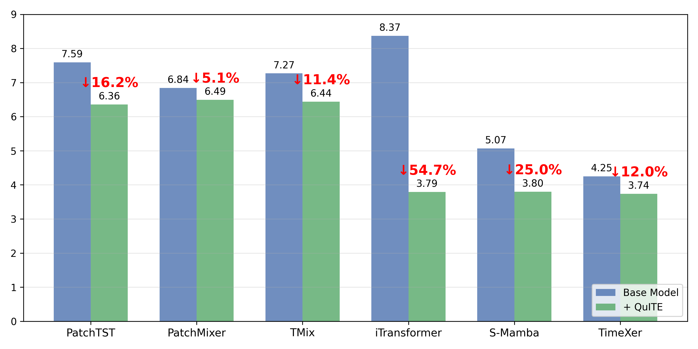
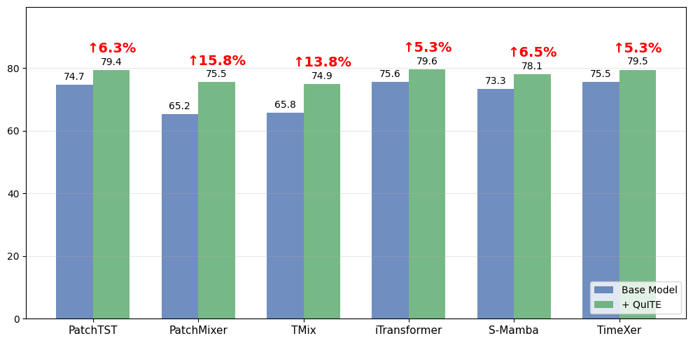
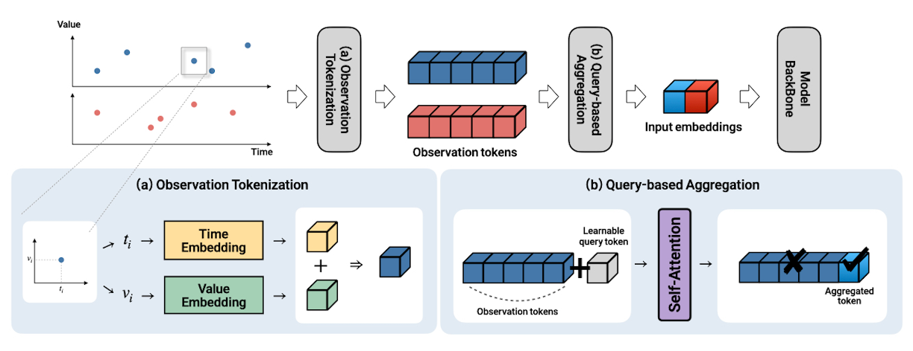
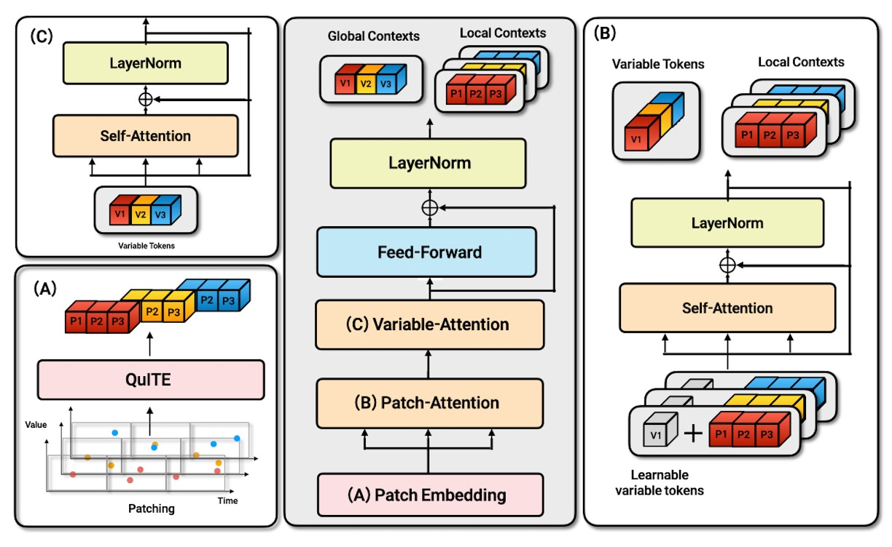

<div align="center">

# QuITE: Query-Based Irregular Time Series Embedding

[](https://icml.cc/Conferences/2026)
[](https://www.python.org)
[](https://pytorch.org)
[](https://opensource.org/licenses/MIT)

**Official PyTorch implementation** of  *QuITE: Query-Based Irregular Time Series Embedding* (ICML 2026).

A plug-and-play **input-embedding** module that lets any standard MTS backbone — PatchTST, PatchMixer, TMix, iTransformer, S-Mamba, TimeXer — handle **Irregular Multivariate Time Series (IMTS)** without architectural changes or artificial value generation.

[Overview](#-overview) · [Model](#-model) · [Datasets](#-datasets) · [Install](#-installation) · [Quick Start](#-quick-start) · [Reproduce](#-reproducing-paper-results) · [Arguments](#-arguments) · [Citation](#-citation)

</div>

---

## 🔥 News

- **2026-05-01** — **QuITE** is accepted by **ICML 2026** 🎉

---

## 🧐 Overview

Irregular Multivariate Time Series (IMTS) — non-uniform observation intervals, asynchronous measurements across variables — are common in healthcare, industrial monitoring, and climatology, yet they break the uniform-sampling assumption baked into standard MTS embeddings. We address this at the **input-embedding** stage.

- **QuITE** *(Sec. 4)* — a plug-and-play embedding module. A small set of learnable **query tokens** aggregates irregular observations through a single masked self-attention layer, directly producing backbone-compatible latent representations.
- **QuITE++** *(Sec. 5)* — a hierarchical extension that stacks query-based patch embedding → patch-level self-attention → variable-level self-attention, followed by a cross-attention decoder over future-time queries.

**Headline result.** Across 7 benchmarks and 6 MTS backbones, plugging QuITE in yields average relative gains of **up to 54.7 % in forecasting** and **up to 15.8 % in classification** over the vanilla backbones, while QuITE++ achieves the **best performance on 20 / 24 forecasting settings** (paper Tables 2-4).

### Key Contributions

1. A new **input-embedding-based** approach for IMTS modeling — neither architecture redesign nor data interpolation.
2. **QuITE** — a simple yet effective plug-and-play module that aggregates irregular observations via learnable query tokens + masked self-attention.
3. **QuITE++** — a hierarchical encoder + cross-attention decoder built from the same query-based principle.
4. Consistent gains on **4 forecasting** (Human Activity / USHCN / PhysioNet / MIMIC-III) and **3 classification** (P12 / P19 / PAM) benchmarks across **6 MTS backbones**.

<p align="center">
  
  <br/>
  <em><b>Figure 1 (a).</b> Effectiveness of QuITE on forecasting — QuITE consistently improves all six MTS backbones across diverse datasets (averaged over all datasets).</em>
</p>

<p align="center">
  
  <br/>
  <em><b>Figure 1 (b).</b> Effectiveness of QuITE on classification — same trend across all six backbones.</em>
</p>

---

## 🧠 Model

<p align="center">
  
  <br/>
  <em><b>Figure 2.</b> Overall Framework of <b>QuITE</b>. Learnable query tokens aggregate irregular observations through a single self-attention layer, producing structured observation-summary tokens. The figure illustrates variable-level aggregation.</em>
</p>

<p align="center">
  
  <br/>
  <em><b>Figure 3.</b> Overall Architecture of <b>QuITE++</b>. A hierarchical encoder models intra-variable patch-level temporal dependencies (B) and inter-variable interactions (C) via learnable query tokens.</em>
</p>

---

## 📊 Datasets

We evaluate on **4 forecasting** and **3 classification** datasets covering healthcare, biomechanics, climate, and human activity. We follow the preprocessing pipeline of [t-PatchGNN](https://github.com/usail-hkust/t-PatchGNN) for forecasting and of [Raindrop](https://github.com/mims-harvard/Raindrop) for classification.

### Forecasting (paper Appendix A.1, Table A.1 (a))

| Dataset | # Samples | # Vars | Avg. Length | Missing | Acquisition |
|---|---:|---:|---:|---:|---|
| **Human Activity** | 5,400 | 12 | 120 | 75.0 % | auto-downloaded |
| **USHCN** | 26,736 | 5 | 163 | 77.9 % | [`small_chunked_sporadic.csv`](https://github.com/edebrouwer/gru_ode_bayes/tree/master) |
| **PhysioNet** | 12,000 | 36 | 74 | 88.4 % | auto-downloaded |
| **MIMIC-III** | 23,457 | 96 | 46 | 96.7 % | credentialed access ([here](https://physionet.org/content/mimiciii/1.4/)) |

**MIMIC-III** requires the [PhysioNet Credentialed Health Data License](https://physionet.org/content/mimiciii/view-dua/1.4/); after downloading v1.4 follow the [Neural Flows preprocessing](https://github.com/mbilos/neural-flows-experiments/blob/master/nfe/experiments/gru_ode_bayes/data_preproc/mimic_prep.ipynb) to obtain `full_dataset.csv`.

### Classification (paper Appendix A.2, Table A.1 (b))

| Dataset | # Samples | # Vars | # Classes | Missing | Processed Data |
|---|---:|---:|---:|---:|---|
| **P19** | 38,803 | 34 | 2 (binary) | 94.9 % | [figshare 19514338](https://doi.org/10.6084/m9.figshare.19514338.v1) |
| **P12** | 11,988 | 36 | 2 (binary) | 88.4 % | [figshare 19514341](https://doi.org/10.6084/m9.figshare.19514341.v1) |
| **PAM** |  5,333 | 17 | 8 (activity) | 60.0 % | Raindrop protocol |

- **P19** — PhysioNet Sepsis Early-Prediction Challenge 2019 (sepsis-onset within 6 h). Raw data: <https://physionet.org/content/challenge-2019/1.0.0/>
- **P12** — PhysioNet Mortality Challenge 2012 (first 48 h ICU, ICU-stay > 3 days). Raw data: <https://physionet.org/content/challenge-2012/1.0.0/>
- **PAM** — PAMAP2-derived 8-class activity dataset; we follow the [Raindrop](https://github.com/mims-harvard/Raindrop) preprocessing protocol. Raw data: <https://archive.ics.uci.edu/dataset/231/pamap2+physical+activity+monitoring>

Expected layout (sibling of the repository):

```
../data/
├── activity/   # auto-downloaded
├── physionet/  # auto-downloaded
├── ushcn/      # small_chunked_sporadic.csv
├── mimic/      # full_dataset.csv (credentialed access required)
├── P19/        # processed Raindrop splits
├── P12/        # processed Raindrop splits
└── PAM/        # processed Raindrop splits
```

---

## 🛠 Installation

QuITE has been tested with **Python 3.10+** and **PyTorch 2.0+**.

```bash
git clone https://github.com/Meaningfull9502/QuITE.git
cd QuITE
pip install -r requirements.txt
```

For the **S-Mamba** backbone, additionally install [`mamba-ssm`](https://github.com/state-spaces/mamba):

```bash
pip install mamba-ssm
```

---

## ⚡ Quick Start

Once the datasets are placed under `../data/`, the smallest possible runs are:

```bash
# QuITE + iTransformer on PhysioNet (default horizon 24 → 24)
python train_forecasting.py \
    --dataset physionet --history 24 \
    --patch_size 6 --stride 6 \
    --hid_dim 64 --nhead 4 --nlayer 3 \
    --batch_size 64 --lr 1e-3 --patience 50 \
    --seed 1 --gpu 0 \
    --irr_emb --model itransformer --mode quite
```

```bash
# QuITE++ on the same setting
python train_quite_plus.py \
    --dataset physionet --history 24 \
    --patch_size 6 --stride 6 \
    --hid_dim 64 --nhead 4 --nlayer 2 \
    --batch_size 64 --lr 1e-3 --patience 50 \
    --seed 1 --gpu 0
```

```bash
# QuITE + PatchTST on P19 classification
python train_classification.py \
    --dataset P19 \
    --patch_size 3.75 --stride 3.75 \
    --hid_dim 64 --nhead 2 --nlayer 3 \
    --batch_size 64 --lr 1e-3 --epoch 1000 \
    --gpu 0 --irr_emb --model patchtst --mode quite
```

---

## 🔁 Reproducing Paper Results

Three batch scripts reproduce the paper tables end-to-end:

```bash
bash jobs/run_forecasting.sh    # Table 2  — 6 backbones × 12 (dataset, horizon) settings × 5 seeds
bash jobs/run_quite_plus.sh     # Table 4  — QuITE++ on 12 settings × 5 seeds
bash jobs/run_classification.sh # Table 3  — 6 backbones × 3 datasets
```

Per-dataset hyperparameters (paper Table C.1):

#### Forecasting

| Dataset | Horizon | `--patch_size` / `--stride` | `--batch_size` |
|---|---|---:|---:|
| Human Activity | 3000 → 1000 | 750 / 750 | 32 |
| Human Activity | 2000 → 2000 | 500 / 500 | 32 |
| Human Activity | 1000 → 3000 | 250 / 250 | 32 |
| USHCN | 24 → {1, 6, 12} | 1.5 / 1.5 | 128 |
| PhysioNet | 12 → 36 | 6 / 6 | 64 |
| PhysioNet | 24 → 24 | 6 / 6 | 64 |
| PhysioNet | 36 → 12 | 9 / 9 | 64 |
| MIMIC-III | 12 → 36 | 6 / 6 | 16 |
| MIMIC-III | 24 → 24 | 12 / 12 | 8 |
| MIMIC-III | 36 → 12 | 4.5 / 4.5 | 8 |

#### Classification

| Dataset | `--patch_size` / `--stride` | `--batch_size` |
|---|---:|---:|
| P19 | 3.75 / 3.75 | 64 |
| P12 | 6 / 6 | 64 |
| PAM | 10 / 10 | 64 |

All runs use `--lr 1e-3`, `--patience 50` (forecasting), `--epoch 1000 --patience 10` (classification), and **5 seeds {1, …, 5}** (paper §6.1).

---

## 🧱 Supported Backbones

Selectable via `--model`. The batch scripts in `jobs/` automatically set `--nlayer` according to paper Appendix B.1; the table below records the recommended values for manual runs.

| Family | `--model` | Token type | `--nlayer` |
|---|---|---|:---:|
| **Patch** | `patchtst` | per-patch (channel-independent Transformer) | 3 |
| **Patch** | `patchmixer` | per-patch (CNN, single-layer) | 1 |
| **Patch** | `tmix` | per-patch (MLP, TSMixer-style) | 2 |
| **Variate** | `itransformer` | per-variable (inverted Transformer) | 3 |
| **Variate** | `s_mamba` | per-variable (bidirectional Mamba) | 2 |
| **Hybrid** | `timexer` | per-patch + per-variable exogenous | 3 |

> **Note on TimeXer.** As a *hybrid* backbone, TimeXer consumes patch-level tokens together with a variable-level exogenous context — two embeddings are instantiated internally (`patch_embedding` + `variate_embedding`) and the chosen `--mode` is applied to both.

Other QuITE-equipped settings are standardized to `--hid_dim 64`, `--nhead 4` (forecasting), `--nhead 2` (classification) — paper §6.1.

---

## 🎛 Embedding Modes

Selectable via `--mode`. Whether `--irr_emb` is required is summarized below.

| `--mode` | Meaning | Paper | Pair with `--irr_emb`? |
|---|---|---|:---:|
| **`quite`** | **QuITE** — query-based irregular embedding (paper main method) | Eq. 5-13 | ✅ |
| `mean` | Mean Pooling baseline | Table 5 | ✅ |
| `mtand` | mTAND attention baseline | Table 5 | ✅ |
| `add` | value + time embedding | Table 5 | ❌ |
| `concat` | value ‖ time embedding | Table 5 | ❌ |
| `False` | vanilla backbone embedding (no time conditioning) | — | ❌ |

---

## 🧩 Arguments

| Argument | Meaning |
|---|---|
| `--dataset` | Forecasting: `{activity, ushcn, physionet, mimic}` · Classification: `{P12, P19, PAM}` |
| `--history` | Historical horizon (hours / months / ms depending on dataset) |
| `--pred_window` | Prediction horizon (forecasting only) |
| `--patch_size` / `--stride` | Patch size *P* and stride (set equal to *P*) — paper Sec. 4.2 |
| `--hid_dim` (`-hd`) | Token embedding dimension *d_model* — paper Sec. 4 |
| `--nhead` | Multi-head attention heads |
| `--nlayer` | Backbone encoder layers *L* — see Supported Backbones |
| `--dropout` | Dropout rate (default 0.1) |
| `--batch_size` (`-b`) | Training batch size |
| `--lr` | Learning rate (paper: `1e-3` everywhere) |
| `--epoch` | Maximum training epochs |
| `--patience` | Early-stopping patience (no val-loss improvement) |
| `--seed` | Random seed |
| `--gpu` | GPU id (`CUDA_VISIBLE_DEVICES`) |
| `--model` | MTS backbone — see Supported Backbones |
| `--mode` | Embedding mode — see Embedding Modes |
| `--irr_emb` | Enable QuITE-style query-based irregular embedding |

---

## 📁 Repository Structure

```
QuITE/
├── train_quite_plus.py        # QuITE++ entrypoint  (paper §5)
├── train_forecasting.py       # QuITE + MTS backbone, forecasting
├── train_classification.py    # QuITE + MTS backbone, classification
├── evaluation.py              # MSE / MAE / MAPE
├── utils.py                   # data normalization, t-SNE, logging
├── requirements.txt
│
├── data/                      # dataset loaders
│   ├── parse.py               # parse_datasets(args) — entry
│   ├── physionet.py / mimic.py / ushcn.py / activity.py
│   └── __init__.py
│
├── models/
│   ├── modules.py             # SelfAttentionBlock / TransformerEncoderBlock / CrossAttentionBlock
│   ├── common.py              # multiTimeAttention, PatchMixerLayer, Transpose, TempBlock
│   ├── quite.py               # unified backbone wrapper (forecasting + classification)
│   ├── quite_plus.py          # QuITE++ — hierarchical encoder + cross-attention decoder
│   ├── embeddings/            # ── paper Eq. 5-13 + Table 5 baselines
│   │   ├── _base.py           #     LearnableTE (Eq. 4)
│   │   ├── quite.py           #     QuITEEmbedding (mode='quite')
│   │   ├── mean_pool.py       #     MeanPoolEmbedding
│   │   ├── mtand.py           #     MTANDEmbedding
│   │   ├── baseline.py        #     Patch / Variate baselines (add / concat / vanilla)
│   │   └── __init__.py        #     get_embedding(args, family) dispatcher
│   └── layers/                # backbone-side layers (PatchTST / iTransformer / TimeXer / Mamba)
│
├── jobs/                      # batch reproduction scripts
│   ├── run_quite_plus.sh
│   ├── run_forecasting.sh
│   └── run_classification.sh
│
└── figs/                      # paper figures embedded in this README
```

---

## 📜 Citation

```bibtex
@inproceedings{lim2026quite,
  title     = {QuITE: Query-Based Irregular Time Series Embedding},
  author    = {Lim, JungHoon},
  booktitle = {Proceedings of the 43rd International Conference on Machine Learning},
  series    = {Proceedings of Machine Learning Research},
  volume    = {306},
  address   = {Seoul, South Korea},
  publisher = {PMLR},
  year      = {2026}
}
```

---

## 🙏 Acknowledgements

We thank the authors of [t-PatchGNN](https://github.com/usail-hkust/t-PatchGNN), [Raindrop](https://github.com/mims-harvard/Raindrop), [Time-Series-Library](https://github.com/thuml/Time-Series-Library), [S-D-Mamba](https://github.com/wzhwzhwzh0921/S-D-Mamba), and [Hi-Patch](https://github.com/qianlima-lab/Hi-Patch) — our data pipelines and baseline implementations build heavily on their excellent open-source releases.
